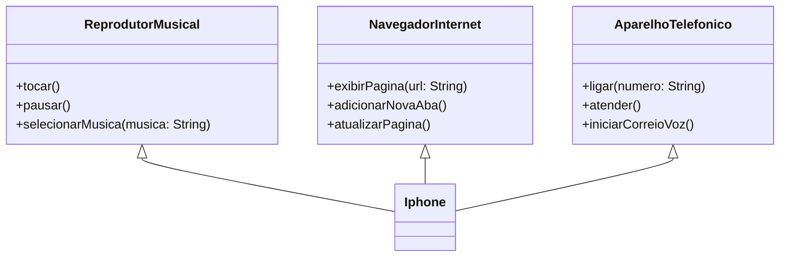

# UML-IPHONE
uml components iphone

```mermaid
classDiagram

    class Iphone{
    }
    class ReprodutorMusical {
        +tocar()
        +pausar()
        +selecionarMusica(musica: String)
    }

    class AparelhoTelefonico {
        +ligar(numero: String)
        +atender()
        +iniciarCorreioVoz()
    }

    class NavegadorInternet {
        +exibirPagina(url: String)
        +adicionarNovaAba()
        +atualizarPagina()
    }

    ReprodutorMusical <|-- Iphone
    NavegadorInternet <|-- Iphone
    AparelhoTelefonico <|-- Iphone
```
